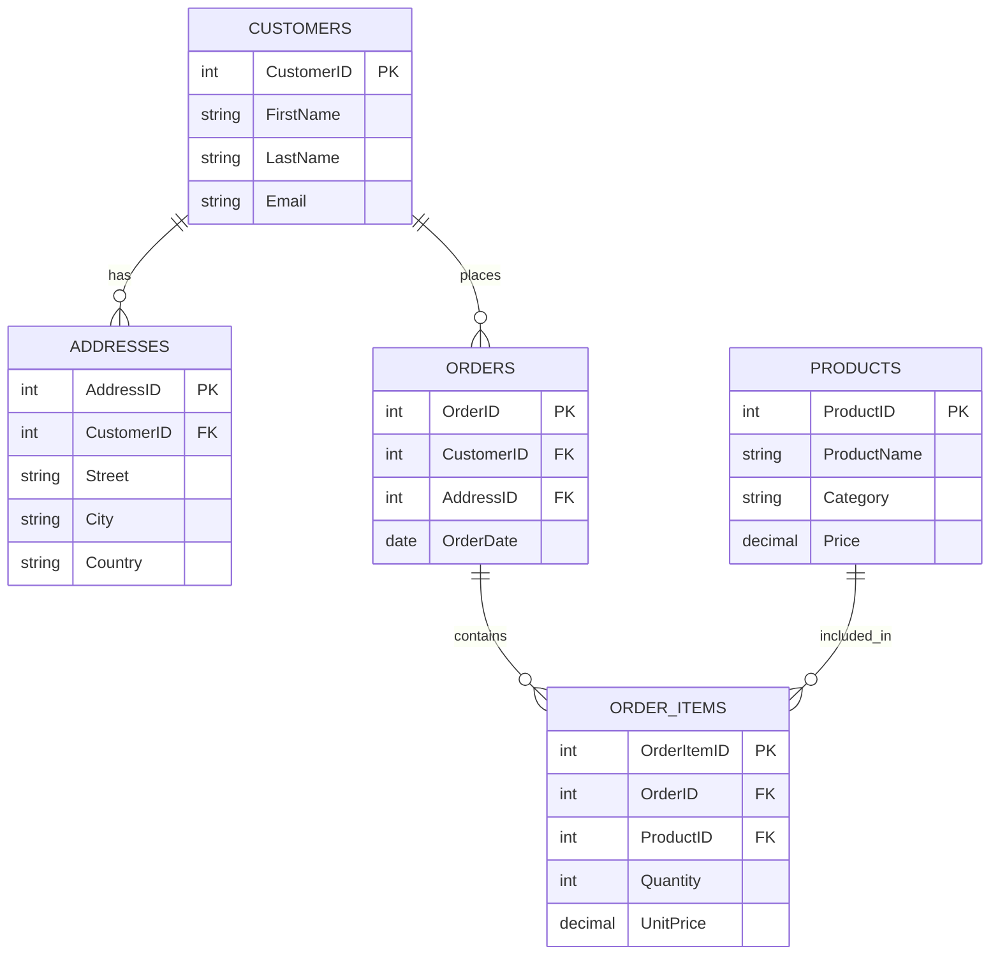
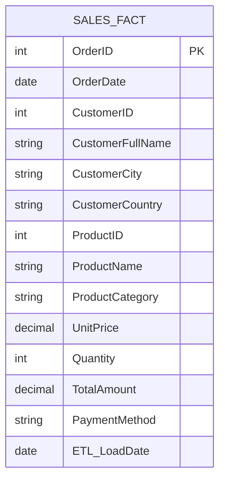
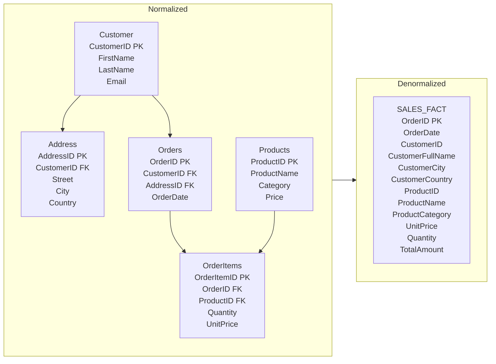

# 🔶 What is Denormalization?

Denormalization is the process of intentionally adding redundancy into a database to improve read performance, especially for reporting, analytics, dashboards, and OLAP systems.

👉 In normalization, we split data into multiple related tables to reduce redundancy.

👉 In denormalization, we combine tables or duplicate data to make querying faster and simpler.

### In simple terms:

> Normalization = less redundancy → more joins
>
> Denormalization = fewer joins → faster queries

# 🔶 **Why Do We Use Denormalization?**

Because in analytics and reporting systems (like **Power BI, OLAP cubes**), users expect **fast read performance**, and those systems often query **large tables** many times.

Denormalization helps by:

* Reducing number of joins
* Improving query speed
* Simplifying data models
* Making star-schema fact tables easier to use

---

# 🔶 **Techniques of Denormalization**

Here are the common methods:

### **1️⃣ Combine Tables (Merging)**

Merge two normalized tables into one to avoid joins.
Example: Customer table + Address table merged.

### **2️⃣ Add Redundant Columns**

Store calculated or repeated values to reduce computation.
Example: Store "Total Order Amount" in fact table instead of recalculating.

### **3️⃣ Pre-Computed Aggregations**

Store monthly sales, yearly totals, etc., instead of computing every time.

### **4️⃣ Add Lookup Values Inside Fact Table**

Instead of using many dimension tables, store descriptive fields inside fact table.

---

# 🔶 **Use Cases of Denormalization (Very Important for Power BI)**

## ⭐ **Use Case 1: Reporting and Dashboards**

Dashboards (Power BI/Tableau) need **fast read performance**.
If data is heavily normalized, each visual would perform many joins → slow.

👉 Solution: Denormalize into a **Star Schema** (Fact + Dimensions).

**Example:**

* FactSales (Denormalized)
* DimCustomer
* DimProduct
* DimDate

This gives faster visuals and better compression.

---

## ⭐ **Use Case 2: OLAP Systems (Data Warehousing)**

OLTP → Normalized
OLAP → Denormalized

**Why?**
OLAP focuses on **read-heavy** operations and aggregations.

Typical denormalized structures:

* Star Schema
* Snowflake Schema (semi-normalized)
* Wide Tables (big tables with many columns)

---

## ⭐ **Use Case 3: Reducing Expensive Joins in Big Data**

When data size is huge, joins cost a lot of time and memory.

**Example:**
A 500M row fact table joining 6 dimension tables.
Denormalizing 1–2 dimensions into the fact table improves performance.

---

## ⭐ **Use Case 4: Pre-Computed Columns for Optimization**

Instead of calculating columns repeatedly in your queries or DAX:

Examples:

* TotalAmount = Quantity × Price
* Age = CurrentYear − BirthYear
* FullName = FirstName + LastName

Storing these results saves processing time.

---

## ⭐ **Use Case 5: Materialized Views / Summary Tables**

Create summary tables for faster dashboard performance.

Examples:

* Sales by Month
* Sales by Region
* Inventory by Category

These "summary tables" are a form of denormalization.

---
# ⭐ **1) Real-world case studies (concise, practical)**

## E-commerce — objective: speed up product & sales reporting for dashboards

#### Situation (normalized): Orders, Customers, Products, ShippingAddress split into many tables. Every dashboard query joins Orders → Customers → Products → Addresses → Promotions → Inventory.
#### Denormalization approach: create a Sales_Fact wide table that embeds customer name/city, product category, product price at sale, shipping country, and computed TotalAmount. Also maintain smaller pre-aggregated tables for Sales_By_Day and Sales_By_ProductCategory.
#### Why: reduces expensive joins at query time; Power BI visuals load faster and RLS (row-level security) can still be applied on key fields.
#### Tradeoffs: wider rows, data duplication (customer name repeated), must refresh/ETL writes carefully (ETL latency acceptable for reporting).
#### Implementation notes: update Sales_Fact via ETL after order finalization; keep a light normalized OLTP store for transactional updates.
---
---
# ⭐ **2)Banking — objective: fast historical analytics and regulatory reports**

## Situation: normalized transactions linked to accounts, customers, branches, and KYC data. Reports require joining many tables and computing aggregates across years.
#### Denormalization approach: create Transaction_Agg materialized views: daily and monthly aggregates per account and per branch; create Regulatory_Report wide tables that include customer risk score snapshot and account attributes at time-of-report.
#### Why: regulatory reports typically run on a schedule and need stable historical snapshots — denormalized snapshots prevent inconsistent joins across time.
#### Tradeoffs: snapshots increase storage and require governance (audit of ETL/time-of-snapshot). Use checksums and audit columns (snapshot_date, source_version).
#### Implementation notes: keep source-of-truth normalized for writes; use CDC (change data capture) to populate denormalized snapshot tables.
---
---
# ⭐ **3)Healthcare — objective: fast cohort analysis and analytics on patient encounters**

## Situation: encounters, patients, providers, diagnoses, lab results normalized across tables. Cohort queries join many tables and require computed columns (age at encounter, comorbidity flags).
#### Denormalization approach: create Encounter_Analytic table that flattens key patient attributes (age_at_encounter, gender), provider attributes, primary diagnosis label, and precomputed risk scores and flags (e.g., has_diabetes_flag). Build Monthly_Cohort_Summaries.
#### Why: cohort exploration and dashboards need quick filters and aggregations; precomputed flags speed up queries and make life easier for analysts who are not SQL experts.
#### Tradeoffs: medical data requires strict governance and change logging; denormalized tables must store original IDs to allow reconstitution of source data for audits.
#### Implementation notes: include provenance columns (source_encounter_id, etl_run_id), and automate re-computation when definitions change.
---

# 🔶 **When You Should NOT Denormalize**

Avoid denormalization when:
❌ Data changes very frequently
❌ You need strict update consistency
❌ Disk space is very limited
❌ Complex write-heavy systems (OLTP)

---

# 🔶 **Small Example to Make It Very Easy**

### **Normalized (3 tables)**

* Orders
* Customers
* Products

To display a report:
You must join Orders → Customers → Products.

### **Denormalized (1 wide table)**

* OrderID
* CustomerName
* CustomerCity
* ProductName
* ProductCategory
* OrderAmount

No joins → Faster queries.

---

# 🔶 **One-Line Summary**

**Denormalization makes databases faster for reading by adding redundancy and reducing joins—very useful for analytics, reporting, and Power BI data models.**

---

If you want, I can also create:
✅ A **Mermaid ER diagram** showing denormalization
✅ A **Markdown snippet** for GitHub
✅ A **real-world case study** (e.g., e-commerce, banking, healthcare)

Would you like that?

