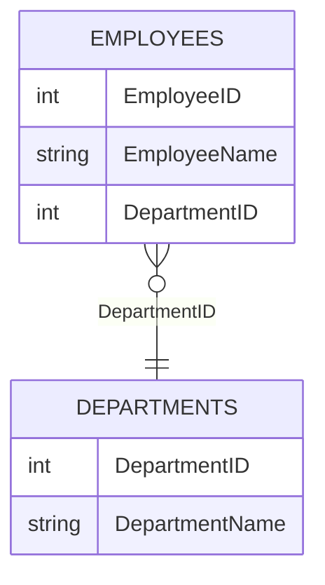
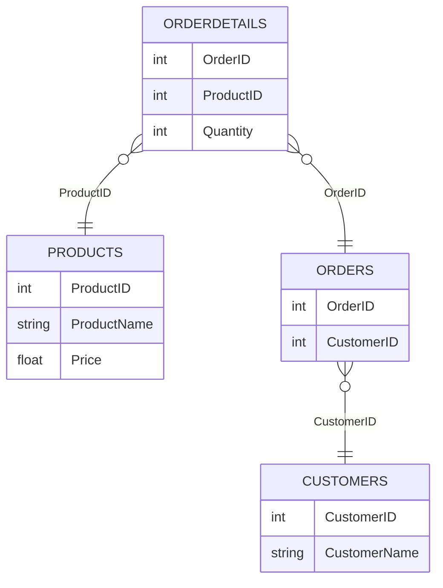

# 📘 Normalization 

---

# ⭐ What is Normalization? (Simple Definition)

Normalization is a method to clean our data table so that:

- No duplicate data

- No confusing / mixed data

- Easy to maintain

- No update problems

---

# 🟢 1NF — First Normal Form  

👉 Every cell contains only one piece of information.

👉 No list inside a column.

👉 No repeated columns.

### ✅ Rules  
- No multiple values in one column  
- No repeating groups  
- Every cell must contain a **single (atomic) value**

### ❌ Bad Example (Not in 1NF)
| Student | PhoneNumbers       |
|--------|---------------------|
| Ram    | 12345, 98765        |
| Sita   | 55555, 66666, 77777 |
### ❌ Example (Not in 1NF)
| Student | PhoneNumbers        |
| ------- | ------------------- |
| Ram     | 12345, 98765        |
| Sita    | 55555, 66666, 77777 |


### ✔ Correct 1NF Table
| Student | PhoneNumber |
|---------|-------------|
| Ram     | 12345       |
| Ram     | 98765       |
| Sita    | 55555       |
| Sita    | 66666       |
| Sita    | 77777       |

---
## 🧩 **1NF Diagram (Visual)**


## 🧩 **1NF Diagram (Visual)**


## 🧩 **1NF Diagram (Mermaid)**

```mermaid
erDiagram
    STUDENT {
        string Student
        string PhoneNumber
    }
````
### ✅ Visual Example

---

# 🟡 2NF — Second Normal Form

👉 2NF applies only when the table has a composite key (two columns acting as the primary key).

👉 If a column depends on only one part of the key (not both),
it violates 2NF.

So:

✔ Non-key columns must depend on the whole primary key,
❌ not on half of it.
### Applies only when:

✔ Table has **composite primary key**
✔ No **partial dependency**

### ❌ Bad Table (Not in 2NF)

Composite Key = OrderID + ProductID

| OrderID | ProductID | ProductName | Quantity |
| ------- | --------- | ----------- | -------- |
| 1       | 101       | Pen         | 2        |
| 1       | 102       | Pencil      | 5        |

❌ Problem:

* ProductName depends only on ProductID (partial dependency)
* ProductName depends only on ProductID,
* Not on the full key (OrderID + ProductID)

➡ This is partial dependency.
---

### ✔ Correct 2NF (Split Tables)

**OrderDetails Table**

| OrderID | ProductID | Quantity |
| ------- | --------- | -------- |

**Products Table**
| ProductID | ProductName |

---
## 🧩 **2NF Diagram (Visual)**


## 🧩 **2NF Diagram (Mermaid)**

```mermaid
erDiagram
    ORDERDETAILS {
        int OrderID
        int ProductID
        int Quantity
    }
    PRODUCTS {
        int ProductID
        string ProductName
    }
    ORDERDETAILS }o--|| PRODUCTS : "ProductID"
```

---

# 🔵 3NF — Third Normal Form

⭐ 3NF means:

👉 Every column should directly describe the main key.

👉 No column should depend on another column that is not the key.

👉 Remove columns that can be placed in their own lookup table.

### 🚫 No Transitive Dependency

Non-key columns must NOT depend on other non-key columns.

---

### ❌ Bad Example (Not in 3NF)

| EmployeeID | EmployeeName | DepartmentID | DepartmentName |
| ---------- | ------------ | ------------ | -------------- |

❌ Problem:
DepartmentName depends on DepartmentID (not primary key)

---

### ✔ Correct 3NF Structure

**Employees Table**
| EmployeeID | EmployeeName | DepartmentID |

**Departments Table**
| DepartmentID | DepartmentName |

---
## 🧩 **3NF Diagram (Visual)**


## 🧩 **3NF Diagram (Mermaid)**



---

# 🟣 Putting It All Together (Full Example)

### Starting Table (Bad)

| OrderID | CustomerName | Product | ProductPrice | Qty |
| ------- | ------------ | ------- | ------------ | --- |
| 1       | Ram          | Pen     | 10           | 2   |
| 1       | Ram          | Pencil  | 5            | 3   |

---

## ✔ 1NF → Already atomic

No multivalues.

---

## ✔ 2NF → Split customer & product

**Orders**

| OrderID | CustomerName |
| ------- | ------------ |

**OrderDetails**
| OrderID | Product | Qty |

**Products**
| Product | ProductPrice |

---

## ✔ 3NF → Remove transitive dependencies

**Customers Table**
| CustomerID | CustomerName |

**Products Table**
| ProductID | ProductName | ProductPrice |

**Orders Table**
| OrderID | CustomerID |

**OrderDetails Table**
| OrderID | ProductID | Qty |

---

## 🧩 **Complete ER Diagram**



---

# 🟢 Normalization Summary Table

| Normal Form | Simple Meaning           | Fix                  |
| ----------- | ------------------------ | -------------------- |
| **1NF**     | No multiple values       | Split rows           |
| **2NF**     | No partial dependency    | Split tables         |
| **3NF**     | No transitive dependency | Create lookup tables |

---
# 🟢 Normalization Summary Table
# 📌 Where This Helps in Power BI

* Removes duplicate values
* Reduces data size
* Fixes many-to-many issues
* Improves relationship modeling
* Enables star schema (fact + dimension)

---

